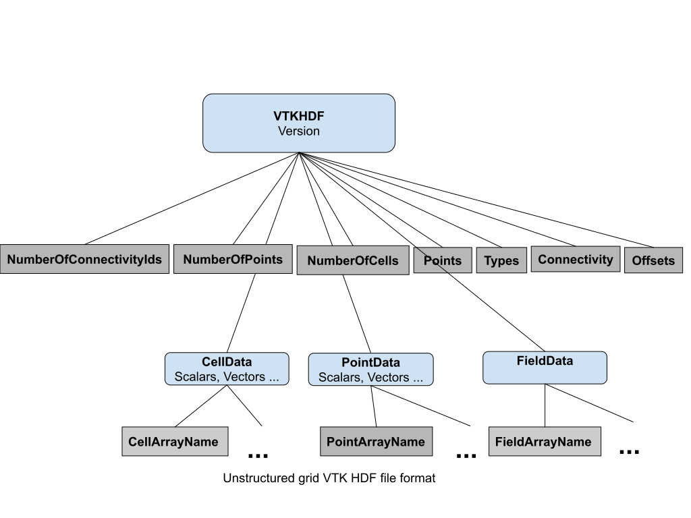

# VTK HDF Readers

VTK 10.0 introduces the VTK HDF format for VTK datasets: ImageData,
and UnstructuredGrid (other datasets will be added later). We use the
same extension for serial and parallel readers and for all types of
datasets. We use HDF standard file extensions such as hdf, hdf5, h5 or
he5.

In the following diagrams showing HDF5 file structure for VTK
datasets, the rounded blue rectangles are HDF groups and the gray
rectangles are HDF datasets. Each rectangle shows the name of the
group or dataset in bold and the attributes underneath with regular
script.

VTK HDF files start with a group called VTKHDF with one attribute:
Version, an array of two integers. Additional attributes can follow
depending on the dataset type stored in the file.

The data type for each HDF dataset is part of the dataset and it is
determined at write time. The reader matches the type of the dataset
with a H5T_NATIVE_ type and creates the VTK array of that
type. Consequently, the type at writing might be different than the
type at reading even on the same machine because long can be the same
type as long long or int can be the same as long on certain
platforms. Also, vtkIdType is read as the C++ type it represents (long
or long long). Endianness conversions are done automatically.

## Image data

An ImageData (regular grid) is not split into partitions. We rely on
the writer to chunk the data to optimize reading for a certain number
of MPI ranks. Attribute data is stored in a PointData or CellData
array using hyper slabs.


## Unstructured grid
The unstructured grid is split into partitions, with a partition for
each MPI node. This is reflected in the HDF5 file structure. Each data
HDF dataset is obtained by concatenating the data for each
partition. The offset O(i) where we store the data for partition i,
when we know the size S(i) of all partitions before, is computed
using:

O(i) = S(0) + ... + S(i-1), i > 1 with O(0) = 0.

An unstructured grid file has a HDF5 structure shown in the next
picture. We describe the split into partitions using HDF5 datasets
NumberOfConnectivityIds, NumberOfPoints and NumberOfCells. Let n be
the number of partitions which usually correspond to the number of the
MPI ranks. NumberOfConnectivityIds has size n where
NumberOfConnectivityIds[i] represents the size of the Connectivity
array for partition i. NumberOfPoints and NumberOfCells are arrays of
size n, where NumberOfPoints[i] and NumberOfCells[i] are the number of
points and number of cells for partition i. The Points array contains
the points of the VTK dataset. Offsets is an array of size ∑ S(i),
where S(i) is the size of partition i, indicating the index in the
Connectivity array where each cell's points start.  Connectivity
stores the lists of point ids for each cell, and Types contain the
cell information stored as described in vtkCellArray
documentation. Data for each partition is appended in a HDF dataset
for Points, Connectivity, Offsets, Types, PointData and CellData. We
can compute the size of partition S(i) using the following formulas:

|   | Size of partition i |
|:--|:--|
| Points  | S(i) = NumberOfPoints[i] * 3 * sizeof(Points[0][0])  |
| Connectivity  | S(i) = NumberOfConnectivityIds[i] * sizeof(Connectivity[0]) |
| Offsets  | S(i) = (NumberOfCells[i] + 1) * sizeof(Offsets[0]) |
| Types  | S(i) = NumberOfCells[i] * sizeof(Types[i]) |
| PointData  | S(i) = NumberOfPoints[i] * sizeof(point_array_k[0]) |
| CellData | S(i) = NumberOfCells[i] * sizeof(cell_array_k[0]) |



To read data, nodes read the information about all partitions, compute
the correct offset and then read data from that offset.

## Examples

We present two examples of VTK HDF files, shown using h5dump -A one image file and one unstructured grid.

### ImageData

The image data file is a wavelet source produced in ParaView. Note
that we don't partition image data, so the same format is used for
serial and parallel processing.

```
HDF5 "./ExternalData/Testing/Data/mandelbrot-vti.hdf" {
GROUP "/" {
   GROUP "VTKHDF" {
      ATTRIBUTE "Direction" {
         DATATYPE  H5T_IEEE_F64LE
         DATASPACE  SIMPLE { ( 9 ) / ( 9 ) }
         DATA {
         (0): 1, 0, 0, 0, 1, 0, 0, 0, 1
         }
      }
      ATTRIBUTE "Origin" {
         DATATYPE  H5T_IEEE_F64LE
         DATASPACE  SIMPLE { ( 3 ) / ( 3 ) }
         DATA {
         (0): -1.75, -1.25, 0
         }
      }
      ATTRIBUTE "Spacing" {
         DATATYPE  H5T_IEEE_F64LE
         DATASPACE  SIMPLE { ( 3 ) / ( 3 ) }
         DATA {
         (0): 0.131579, 0.125, 0.0952381
         }
      }
      ATTRIBUTE "Version" {
         DATATYPE  H5T_STD_I64LE
         DATASPACE  SIMPLE { ( 2 ) / ( 2 ) }
         DATA {
         (0): 1, 0
         }
      }
      ATTRIBUTE "WholeExtent" {
         DATATYPE  H5T_STD_I64LE
         DATASPACE  SIMPLE { ( 6 ) / ( 6 ) }
         DATA {
         (0): 0, 19, 0, 20, 0, 21
         }
      }
      GROUP "PointData" {
         ATTRIBUTE "Scalars" {
            DATATYPE  H5T_STRING {
               STRSIZE 18;
               STRPAD H5T_STR_NULLPAD;
               CSET H5T_CSET_ASCII;
               CTYPE H5T_C_S1;
            }
            DATASPACE  SCALAR
            DATA {
            (0): "IterationsGradient"
            }
         }
         DATASET "Iterations" {
            DATATYPE  H5T_IEEE_F32LE
            DATASPACE  SIMPLE { ( 22, 21, 20 ) / ( 22, 21, 20 ) }
         }
         DATASET "IterationsGradient" {
            DATATYPE  H5T_IEEE_F64LE
            DATASPACE  SIMPLE { ( 22, 21, 20, 3 ) / ( 22, 21, 20, 3 ) }
         }
         DATASET "Iterations_double" {
            DATATYPE  H5T_IEEE_F64LE
            DATASPACE  SIMPLE { ( 22, 21, 20 ) / ( 22, 21, 20 ) }
         }
         DATASET "point_index_llong" {
            DATATYPE  H5T_STD_I64LE
            DATASPACE  SIMPLE { ( 22, 21, 20 ) / ( 22, 21, 20 ) }
         }
         DATASET "xextent_int" {
            DATATYPE  H5T_STD_I32LE
            DATASPACE  SIMPLE { ( 22, 21, 20 ) / ( 22, 21, 20 ) }
         }
         DATASET "xextent_long" {
            DATATYPE  H5T_STD_I64LE
            DATASPACE  SIMPLE { ( 22, 21, 20 ) / ( 22, 21, 20 ) }
         }
         DATASET "xextent_uint" {
            DATATYPE  H5T_STD_U32LE
            DATASPACE  SIMPLE { ( 22, 21, 20 ) / ( 22, 21, 20 ) }
         }
         DATASET "xextent_ulong" {
            DATATYPE  H5T_STD_U64LE
            DATASPACE  SIMPLE { ( 22, 21, 20 ) / ( 22, 21, 20 ) }
         }
      }
   }
}
}
```

### UnstructuredGrid

The unstructured grid is the can example (only the can, not the brick) from ParaView, partitioned in three:

```
HDF5 "./ExternalData/Testing/Data/can-pvtu.hdf" {
GROUP "/" {
   GROUP "VTKHDF" {
      ATTRIBUTE "Version" {
         DATATYPE  H5T_STD_I64LE
         DATASPACE  SIMPLE { ( 2 ) / ( 2 ) }
         DATA {
         (0): 1, 0
         }
      }
      GROUP "CellData" {
         DATASET "EQPS" {
            DATATYPE  H5T_IEEE_F64LE
            DATASPACE  SIMPLE { ( 5480 ) / ( H5S_UNLIMITED ) }
         }
         DATASET "vtkGhostType" {
            DATATYPE  H5T_STD_U8LE
            DATASPACE  SIMPLE { ( 5480 ) / ( H5S_UNLIMITED ) }
         }
         DATASET "vtkOriginalCellIds" {
            DATATYPE  H5T_STD_I64LE
            DATASPACE  SIMPLE { ( 5480 ) / ( H5S_UNLIMITED ) }
         }
      }
      DATASET "Connectivity" {
         DATATYPE  H5T_STD_I64LE
         DATASPACE  SIMPLE { ( 43840 ) / ( H5S_UNLIMITED ) }
      }
      GROUP "FieldData" {
         DATASET "ElementBlockIds" {
            DATATYPE  H5T_STD_I32LE
            DATASPACE  SIMPLE { ( 1 ) / ( 1 ) }
         }
         DATASET "Info_Records" {
            DATATYPE  H5T_STD_I8LE
            DATASPACE  SIMPLE { ( 4, 81 ) / ( 4, 81 ) }
         }
         DATASET "KE" {
            DATATYPE  H5T_IEEE_F64LE
            DATASPACE  SIMPLE { ( 44 ) / ( 44 ) }
         }
         DATASET "NSTEPS" {
            DATATYPE  H5T_IEEE_F64LE
            DATASPACE  SIMPLE { ( 44 ) / ( 44 ) }
         }
         DATASET "QA_Records" {
            DATATYPE  H5T_STD_I8LE
            DATASPACE  SIMPLE { ( 24, 33 ) / ( 24, 33 ) }
         }
         DATASET "TMSTEP" {
            DATATYPE  H5T_IEEE_F64LE
            DATASPACE  SIMPLE { ( 44 ) / ( 44 ) }
         }
         DATASET "TimeValue" {
            DATATYPE  H5T_IEEE_F64LE
            DATASPACE  SIMPLE { ( 1 ) / ( 1 ) }
         }
         DATASET "Title" {
            DATATYPE  H5T_STRING {
               STRSIZE H5T_VARIABLE;
               STRPAD H5T_STR_NULLTERM;
               CSET H5T_CSET_ASCII;
               CTYPE H5T_C_S1;
            }
            DATASPACE  SIMPLE { ( 1 ) / ( 1 ) }
         }
         DATASET "XMOM" {
            DATATYPE  H5T_IEEE_F64LE
            DATASPACE  SIMPLE { ( 44 ) / ( 44 ) }
         }
         DATASET "YMOM" {
            DATATYPE  H5T_IEEE_F64LE
            DATASPACE  SIMPLE { ( 44 ) / ( 44 ) }
         }
         DATASET "ZMOM" {
            DATATYPE  H5T_IEEE_F64LE
            DATASPACE  SIMPLE { ( 44 ) / ( 44 ) }
         }
      }
      DATASET "NumberOfCells" {
         DATATYPE  H5T_STD_I64LE
         DATASPACE  SIMPLE { ( 3 ) / ( 3 ) }
      }
      DATASET "NumberOfConnectivityIds" {
         DATATYPE  H5T_STD_I64LE
         DATASPACE  SIMPLE { ( 3 ) / ( 3 ) }
      }
      DATASET "NumberOfPoints" {
         DATATYPE  H5T_STD_I64LE
         DATASPACE  SIMPLE { ( 3 ) / ( 3 ) }
      }
      DATASET "Offsets" {
         DATATYPE  H5T_STD_I64LE
         DATASPACE  SIMPLE { ( 5483 ) / ( H5S_UNLIMITED ) }
      }
      GROUP "PointData" {
         DATASET "ACCL" {
            DATATYPE  H5T_IEEE_F64LE
            DATASPACE  SIMPLE { ( 8076, 3 ) / ( H5S_UNLIMITED, 3 ) }
         }
         DATASET "DISPL" {
            DATATYPE  H5T_IEEE_F64LE
            DATASPACE  SIMPLE { ( 8076, 3 ) / ( H5S_UNLIMITED, 3 ) }
         }
         DATASET "GlobalNodeId" {
            DATATYPE  H5T_STD_I64LE
            DATASPACE  SIMPLE { ( 8076 ) / ( H5S_UNLIMITED ) }
         }
         DATASET "PedigreeNodeId" {
            DATATYPE  H5T_STD_I64LE
            DATASPACE  SIMPLE { ( 8076 ) / ( H5S_UNLIMITED ) }
         }
         DATASET "VEL" {
            DATATYPE  H5T_IEEE_F64LE
            DATASPACE  SIMPLE { ( 8076, 3 ) / ( H5S_UNLIMITED, 3 ) }
         }
         DATASET "vtkGhostType" {
            DATATYPE  H5T_STD_U8LE
            DATASPACE  SIMPLE { ( 8076 ) / ( H5S_UNLIMITED ) }
         }
      }
      DATASET "Points" {
         DATATYPE  H5T_IEEE_F64LE
         DATASPACE  SIMPLE { ( 8076, 3 ) / ( H5S_UNLIMITED, 3 ) }
      }
      DATASET "Types" {
         DATATYPE  H5T_STD_U8LE
         DATASPACE  SIMPLE { ( 5480 ) / ( H5S_UNLIMITED ) }
      }
   }
}
}
```
