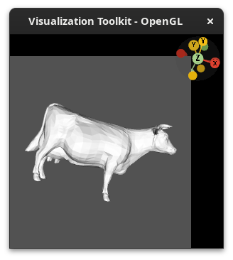
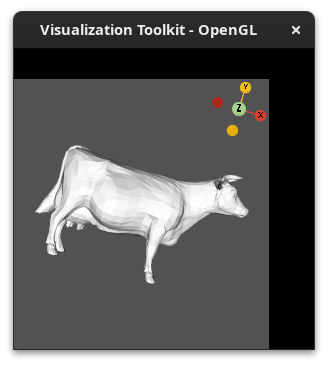

# Camera orientation widget for viewports

The camera orientation widget now supports mini-viewports in the main render window.

Before this change, the widget would always be anchored to one of the corners of the window
irrespective of whether that corner space belongs to the widget's renderer.

| Before | After |
|:------:|:-----:|
|||
